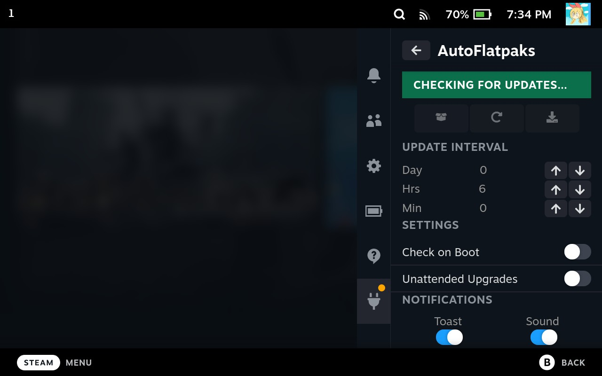
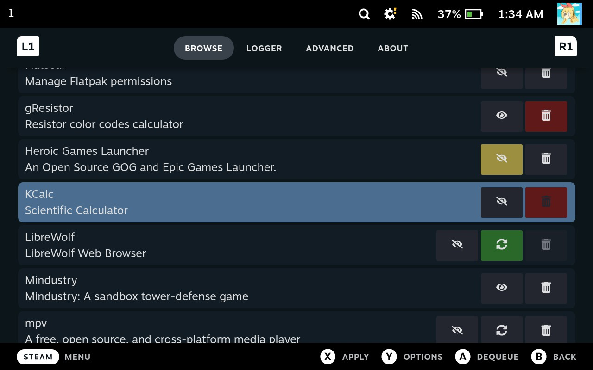
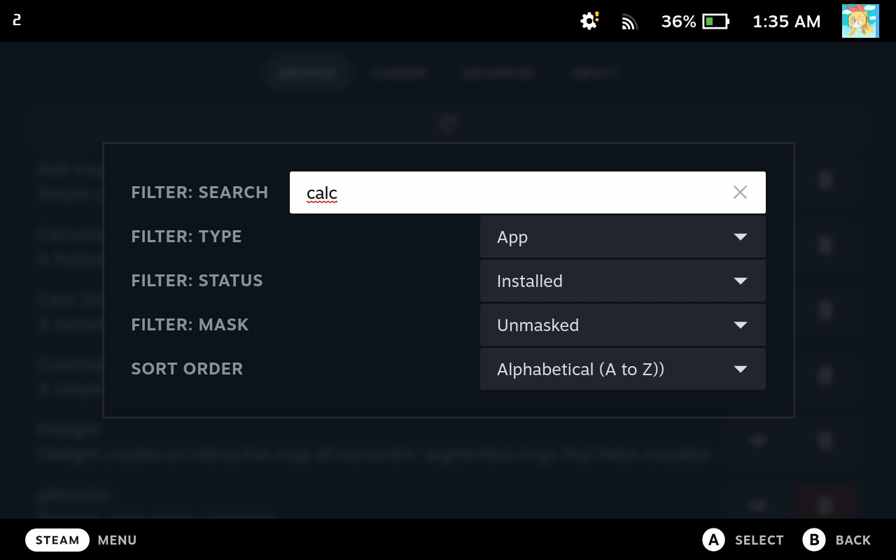
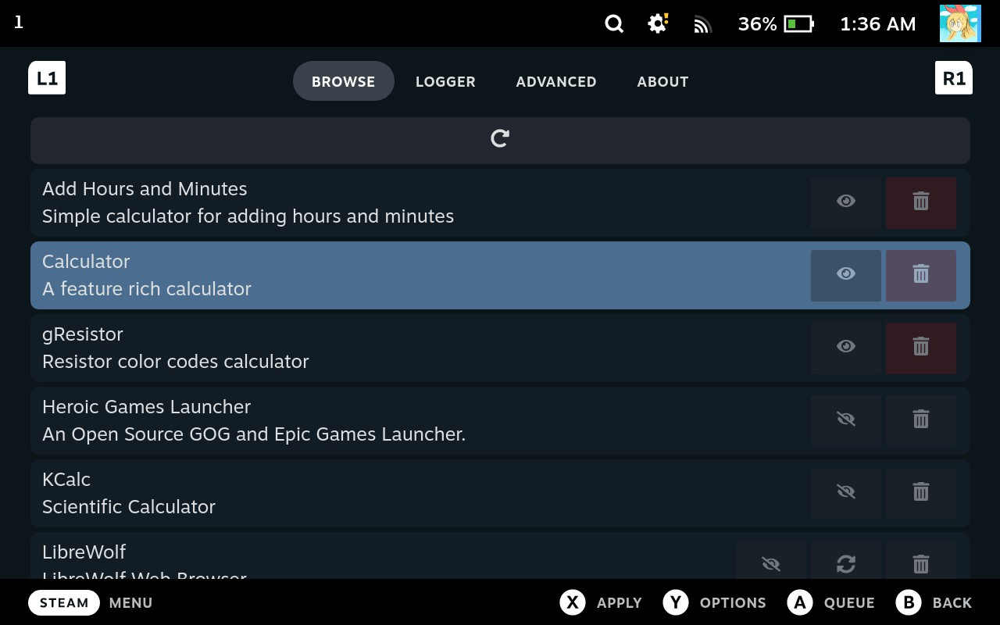
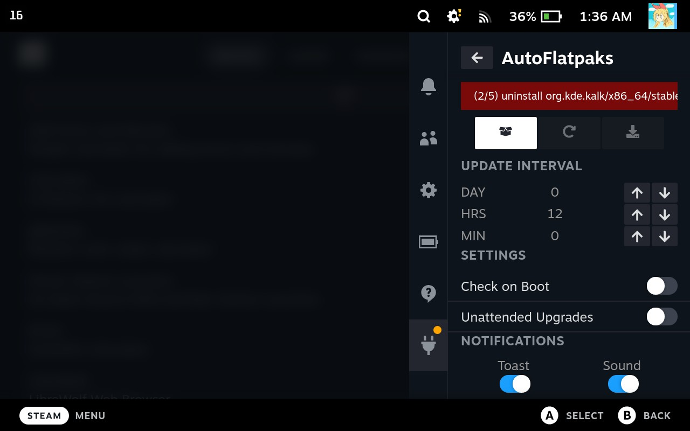
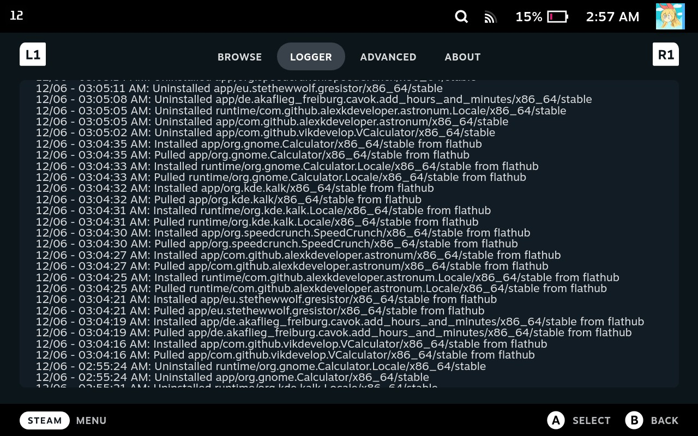
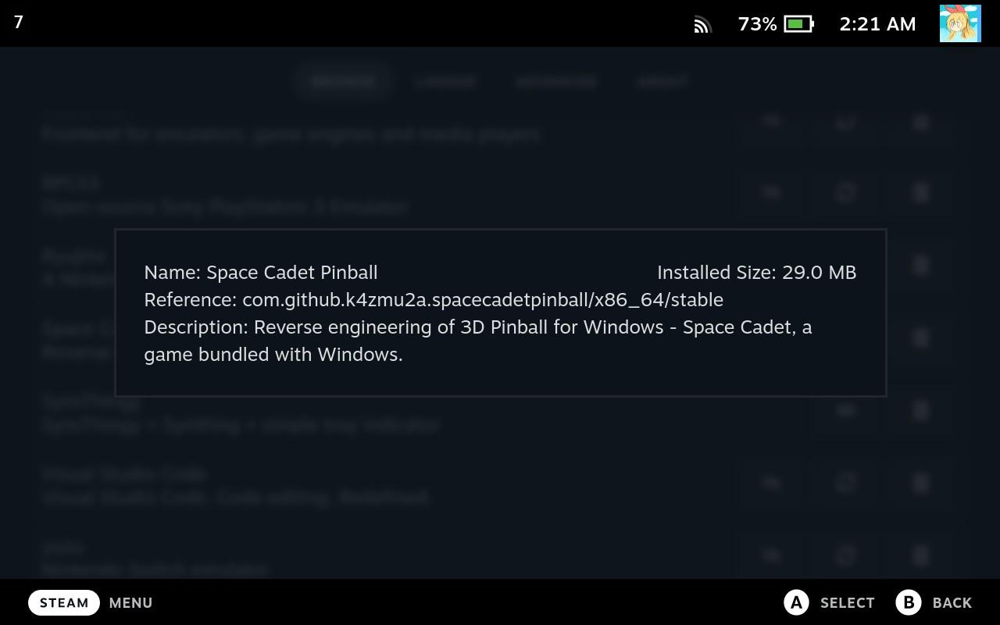

## Decky-AutoFlatpaks Plugin
A plugin to manage, notify, and automatically update flatpaks on your steamdeck console after an interval of time without DesktopMode. Requires root permissions.

## Screenshots

  
Screenshots

  
  
  
  
  
  
  
  
  https://streamable.com/j4lh5y

## Overview
This plugin provides audible and toast notifications when finding flatpak package updates and allows the user to update them at their leisure or automatically at user-defined intervals. The notifications can be toggled off if completely silent updates are preferred. There is also a relatively all-in-one (wip) flatpak manager for installing, uninstalling, masking, unmasking, and updating flatpaks.

## Installation
#### Decky-Loader Store
1. [Install decky-loader](https://github.com/SteamDeckHomebrew/decky-loader#installation)
2. Use the built in plugin store to download the AutoFlatpaks plugin
#### Manual Installation
For manual installation, you will need to use the terminal a little and a keyboard would be preferred (not required), but it's not a daunting task and hopefully these instructions will be easy enough to follow. Please follow them in order, from top to bottom.

1. Start the deck in Gaming Mode
2. Open Decky-Loader in the QAM
3. Go to Decky settings
4. Scroll down the General settings using the D-Pad/Joystick, not touch
5. On `Manual plugin install` section, keep navigating using the D-Pad/Joystick until the `URL` entry is highlighted
6. Press A to bring up the virtual keyboard, or use your own keyboard to add the following url:
   - `https://github.com/jurassicplayer/decky-autoflatpaks/releases/latest/download/decky-autoflatpaks.zip`
7. Press `Install` and `Confirm`
8. Go to desktop mode (`Steam` menu => `Power` => `Switch to Desktop`)
9. Open the start menu
10. Search and open the application called `Konsole`
11. Type in the following command
  - `sudo chown -R deck:deck ~/homebrew/plugins/decky-autoflatpaks`
12. Press Enter to run the command (it will prompt for your password, which is the same one you used when you installed decky-loader)
13. Return to Gaming Mode and enjoy \o/

## Usage
### Quick Access Menu
- Open package manager, manually check for updates, and manually install all package updates
- Set the update interval to the desired interval using the arrows
- Check/Uncheck whether to check for updates on boot and upgrading without user interaction
- Adjust notifications to your preference: Toast & Sound, Toast Only, Sound Only, or No notifications
### Package Manager
#### Browse Page
- Select a package to bring up a small modal with some extra information.
- Filter list by text, package type (app/runtime), status (installed, uninstalled, masked, queued, updateable), masked/unmasked, and sort by pressing the Y button and setting the desired options
- Add all actions (install/uninstall/mask/etc.) to the queue by pressing A on the highlighted intended action button
- Start performing queued actions by pressing the X button and wait (or do whatever)
- Use package manager to Mask/Unmask individual packages
  - Masked packages will NOT be upgraded when automatically upgrading
- Use package manager to Install/Uninstal/Upgrade individual packages
  - Masked packages CAN be upgraded manually within the package manager
#### Logger Page
- Shows list of recent installations/uninstallations/upgrades
- This relies on journalctl's entries which by default will erase older entries (conditions unknown)
- Filtering/Sorting entries probably won't be implemented due to the above journalctl behaviour unless the gap is significant enough
#### Advanced Page
- List and remove unused packages

## Functionality
- The default package manager view are all installed apps sorted from A to Z
- Package updating/queue processing happens in the background, so you can return to gaming or w/e else while it's processing (just don't put the console to sleep)
- The package masking and filter search are currently VERY naive implementations, this may change in the future
  - Filter Search filters on exact substring matches within either the application name, id, description, reference, or origin.
  - Masking features currently don't handle any partial masks, only full reference masks.
- Packages marked as EoL (end of life) are pre-filtered out and will not show up in the UI
- Due to how flatpak lists packages, there are a number of duplicate-like application/runtimes
  - These are usually the same package from different branches and as I have no sane way of filtering them, they are still shown
  - For app package types, mainly these are `BaseApp` packages and a handful of others
- Package updates should match what Discover reports (mostly?)
  - Partial package updates are also considered masked when the parent package is masked (Debug/Locale packages)

## Ran Into an Issue?
- In order to properly assess what could potentially be happening, you must be able to reproduce the issue or provide steps for me to attempt reproducing the issue. In the event that you are able to repeatedly reproduce the issue, please follow the following steps and submit the logs so I can fix it for you :D (that's the hope anyways).
#### Obtaining debugging information
- Reset your device
- Ensure that your device and a computer are connected on the same network
- Go to the Decky settings and enable `Allow Remote CEF Debugging`
- From the computer, navigate to `http://<steamdeck-ip>:8081` using a google chrome/chromium-based browser
- On the list of links, click `Steam`
- Click on the `Console` tab
- Set the `Log Level` dropdown (to the right of the `Filter` box) to include `Verbose`
- Reproduce the issue on your device
- Right click on the log and choose `Save as...` OR make screenshots beginning from the line: `Trying to load AutoFlatpaks`
- Upload the file/screenshots to a new/relevant [Github issue](https://github.com/jurassicplayer/decky-autoflatpaks/issues)

## Notes
- All settings changes are instantly applied
- A full flatpak manager interface probably won't happen (definition dependant)

## Thanks
- All of the decky-loader devs
- All the other plugin devs